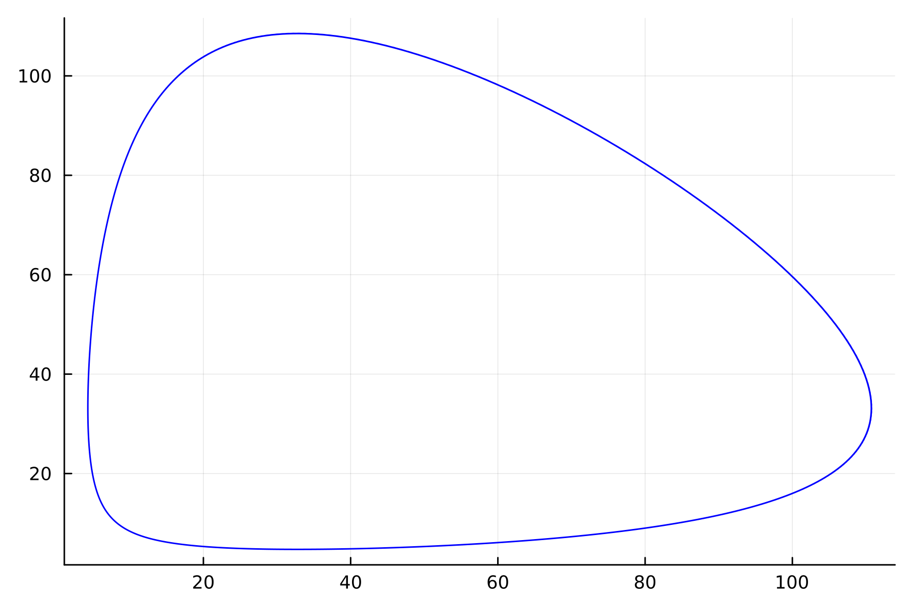
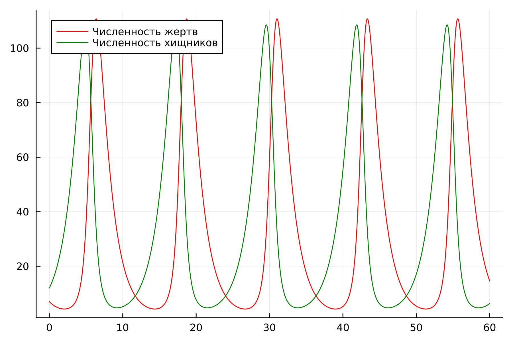
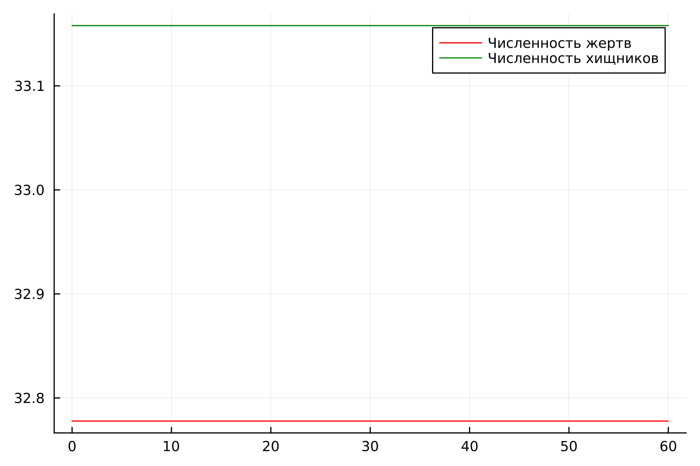
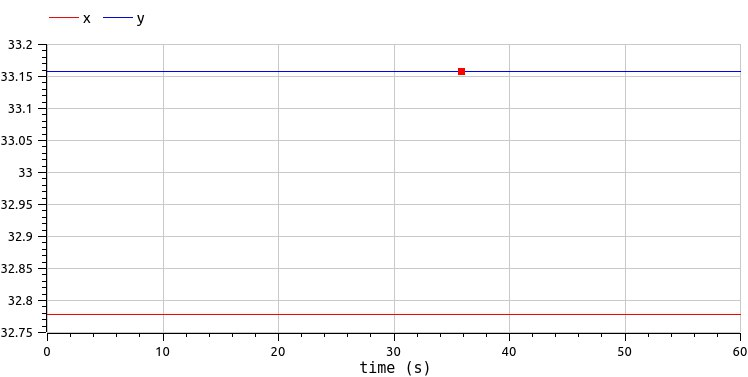

---
## Front matter
lang: ru-RU
title: Лабораторная работа №5
subtitle: Математическое моделирование
author:
  - Данзанова С.З.
institute:
  - Российский университет дружбы народов, Москва, Россия
date: 9 марта 2024 год

babel-lang: russian 
babel-otherlangs: english 
mainfont: Arial 
monofont: Courier New 
fontsize: 12pt

## Formatting pdf
toc: false
toc-title: Содержание
slide_level: 2
aspectratio: 169
section-titles: true
theme: metropolis
header-includes:
 - \metroset{progressbar=frametitle,sectionpage=progressbar,numbering=fraction}
 - '\makeatletter'
 - '\beamer@ignorenonframefalse'
 - '\makeatother'
---

## Докладчик

:::::::::::::: {.columns align=center}
::: {.column width="70%"}

  * Данзанова Саяна Зоригтоевна
  * Студентка группы НПИбд-01-21
  * Студ. билет 1032217624
  * Российский университет дружбы народов

## Цель лабораторной работы

- Изучить жесткую модель хищник-жертва и построить эту модель.

## Задачи

1. Построить график зависимости численности хищников от численности жертв
2. Построить график зависимости численности хищников и численности жертв от времени
3. Найти стационарное состояние системы

## Задание. Вариант 30

Для модели «хищник-жертва»:

$$
 \begin{cases}
	\frac{dx}{dt} = -0.63x(t) + 0.019y(t)x(t)
	\\   
	\frac{dy}{dt} = 0.59y(t) - 0.018y(t)x(t)
 \end{cases}
$$

Постройте график зависимости численности хищников от численности жертв, а также графики изменения численности хищников и численности жертв 
при следующих начальных условиях: $x_0=7, y_0=12$.
Найдите стационарное состояние системы.

# Решение с помощью программ

## Результаты работы кода на Julia и Open Modelica для первого случая (График численности хищников от численности жертв)

:::::::::::::: {.columns align=center}
::: {.column width="50%"}

{#fig:001}

::: 
::: {.column width="50%"}

{#fig:004 width=90% height=90%}

:::
::::::::::::::

## Результаты работы кода на Julia и Open Modelica для второго случая (График численности жертв и хищников от времени)

:::::::::::::: {.columns align=center}
::: {.column width="50%"}

{#fig:002}

::: 
::: {.column width="50%"}

{#fig:005 width=90% height=90%}

:::
::::::::::::::

## Результаты работы кода на Julia и Open Modelica для третьего случая (стационарное состояние)

:::::::::::::: {.columns align=center}
::: {.column width="50%"}

{#fig:003}

::: 
::: {.column width="50%"}

{#fig:006 width=90% height=90%}

:::
::::::::::::::

## Анализ полученных результатов. Сравнение языков.

В итоге проделанной работы мы построили график зависимости численности хищников от численности жертв, а также графики изменения численности хищников и численности жертв на языках Julia и OpenModelica. Построение модели хищник-жертва на языке openModelica занимает меньше строк, чем аналогичное построение на Julia.

## Вывод

В ходе выполнения лабораторной работы была изучена модель хищник-жертва и построена модель на языках Julia и Open Modelica.

## Список литературы. Библиография

[1] Документация по Julia: https://docs.julialang.org/en/v1/

[2] Документация по OpenModelica: https://openmodelica.org/

[3] Решение дифференциальных уравнений: https://www.wolframalpha.com/

[4] Модель Лотки—Вольтерры: https://math-it.petrsu.ru/users/semenova/MathECO/Lections/Lotka_Volterra.pdf