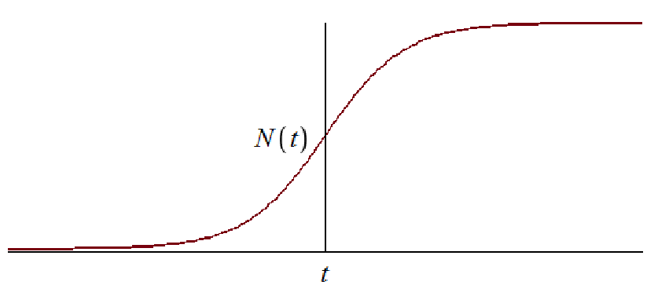

---
## Front matter
lang: ru-RU
title: Лабораторная работа №7
subtitle: Математическое моделирование
author:
  - Данзанова С.З.
institute:
  - Российский университет дружбы народов, Москва, Россия
date: 21 марта 2024 год

babel-lang: russian 
babel-otherlangs: english 
mainfont: Arial 
monofont: Courier New 
fontsize: 12pt

## Formatting pdf
toc: false
toc-title: Содержание
slide_level: 2
aspectratio: 169
section-titles: true
theme: metropolis
header-includes:
 - \metroset{progressbar=frametitle,sectionpage=progressbar,numbering=fraction}
 - '\makeatletter'
 - '\beamer@ignorenonframefalse'
 - '\makeatother'
---

## Докладчик

  * Данзанова Саяна Зоригтоевна
  * Студентка группы НПИбд-01-21
  * Студ. билет 1032217624
  * Российский университет дружбы народов

## Цель лабораторной работы

Изучить и построить модель эффективности рекламы.

## Теоретическое введение

Мальтузианская модель роста (англ. Malthusian growth model), также называемая моделью Мальтуса — это экспоненциальный рост с постоянным темпом. Модель названа в честь английского демографа и экономиста Томаса Мальтуса. [4]

## Теоретическое введние. Построение математической модели (1)

Модель рекламной кампании описывается следующими величинами.
Считаем, что $\frac{dn}{dt}$ - скорость изменения со временем числа потребителей, узнавших о товаре и готовых его купить,
$t$ - время, прошедшее с начала рекламной кампании,
$N$ - общее число потенциальных платежеспособных покупателей,
$n(t)$ - число  уже информированных клиентов.
Эта величина пропорциональна числу покупателей, еще не знающих о нем, это описывается следующим образом
$\alpha _1(t)(N-n(t))$, где $\alpha _1>0$ -  характеризует интенсивность рекламной кампании. Помимо этого, узнавшие о товаре также распространяют полученную информацию среди не знающих о нем. Этот вклад в рекламу описывается величиной  $\alpha _2(t)n(t)(N-n(t))$. Эта величина увеличивается с увеличением потребителей узнавших о товаре.

## Теоретическое введние. Построение математической модели (2)

Математическая модель распространения рекламы описывается уравнением:

$$\frac{dn}{dt} = (\alpha _1(t) + \alpha _2(t)n(t))(N-n(t))$$

## Теоретическое введние. Построение математической модели (3)

При $\alpha _1(t) >> \alpha _2(t)$ получается модель типа модели Мальтуса, решение которой имеет вид 

{ #fig:0001 width=70% height=70% }

## Теоретическое введние. Построение математической модели (4)

В обратном случае $\alpha _1(t) << \alpha _2(t)$ получаем уравнение логистической кривой

{ #fig:0002 width=70% height=70% }

## Задание. Вариант 30

Постройте график распространения рекламы, математическая модель которой описывается следующим уравнением:

1.	$\frac{dn}{dt} = (0.66 + 0.000061n(t))(N-n(t))$
2.	$\frac{dn}{dt} = (0.000056 + 0.66n(t))(N-n(t))$
3.	$\frac{dn}{dt} = (0.66\sin{t} + 0.66\sin{(6t)}  n(t))(N-n(t))$

При этом объем аудитории $N = 860$, в начальный момент о товаре знает 2 человек.

Для случая 2 определите в какой момент времени скорость распространения рекламы будет иметь максимальное значение.

# Ход выполнения лабораторной работы

## Математическая модель

По представленному выше теоретическому материалу были составлены модели на обоих языках программирования.

# Решение с помощью программ

## Результаты работы кода на Julia и Open Modelica для первого случая $\frac{dn}{dt} = (0.66 + 0.000061n(t))(N-n(t))$:

:::::::::::::: {.columns align=center}
::: {.column width="50%"}

{#fig:001}

::: 
::: {.column width="50%"}

{#fig:004}

:::
::::::::::::::

## Результаты работы кода на Julia и Open Modelica для случая $\frac{dn}{dt} = (0.000056 + 0.66n(t))(N-n(t))$:

:::::::::::::: {.columns align=center}
::: {.column width="50%"}

{#fig:002}

::: 
::: {.column width="50%"}

{#fig:005}

:::
::::::::::::::

## Результаты работы кода на Julia и Open Modelica для случая $\frac{dn}{dt} = (0.66\sin{t} + 0.66\sin{(6t)}  n(t))(N-n(t))$:

:::::::::::::: {.columns align=center}
::: {.column width="50%"}

{#fig:003}

::: 
::: {.column width="50%"}

{#fig:006}

:::
::::::::::::::

## Анализ полученных результатов. Сравнение языков.

- В итоге проделанной работы мы построили графики распространения рекламы для трех случаев на языках Julia и OpenModelica. Построение модели распространения рекламы на языке OpenModelica занимает значительно меньше строк, чем аналогичное построение на Julia

- Кроме того, построения на языке OpenModelica проводятся относительно значения времени t по умолчанию, что упрощает нашу работу

# Вывод

## Вывод

В ходе выполнения лабораторной работы была изучена модель эффективности рекламы и в дальнейшем построена модель на языках Julia и Open Modelica.

## Список литературы. Библиография

[1] Документация по Julia: https://docs.julialang.org/en/v1/

[2] Документация по OpenModelica: https://openmodelica.org/

[3] Решение дифференциальных уравнений: https://www.wolframalpha.com/

[4] Мальтузианская модель роста: https://www.stolaf.edu//people/mckelvey/envision.dir/malthus.html